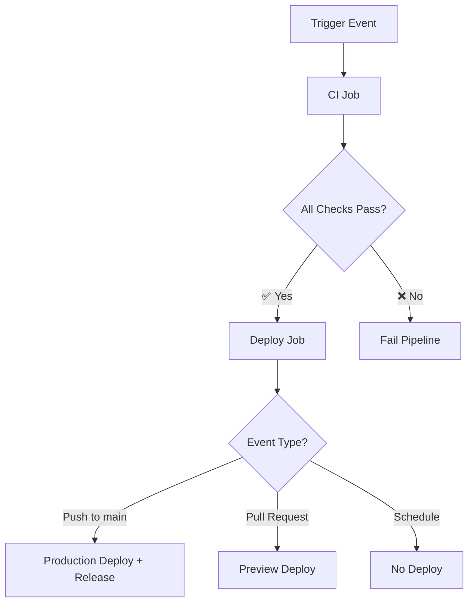

# 🚀 GitHub Actions CI/CD Pipeline

This document describes the streamlined CI/CD pipeline for Couple Connect, optimized for efficiency and maintainability.

## 📋 Pipeline Overview

The pipeline has been optimized from **5 separate jobs** to **2 sequential jobs**, reducing complexity and improving execution time.

### 🔄 Workflow Triggers

- **Push to main**: Full CI + Production deployment
- **Pull Request**: Full CI + Preview deployment
- **Weekly Schedule**: CI + Security audit (Mondays 2 AM)

## 🏗️ Pipeline Architecture



## 🔍 CI Job - Quality & Security

**Duration**: ~3-5 minutes

### Steps Performed

1. **📥 Setup**: Checkout code + Node.js environment
2. **📦 Dependencies**: Install with npm cache
3. **🔍 Quality Checks**:
   - ESLint (code quality)
   - TypeScript type checking
   - Test execution
4. **🔒 Security Checks**:
   - npm audit (vulnerability scan)
   - Dependency review (PR only)
5. **🏗️ Build**: Create production build
6. **📤 Artifacts**: Upload build for deployment

### Optimizations Applied

- **Single dependency install** (vs 4 separate installs)
- **Parallel quality checks** where possible
- **Conditional security checks** based on trigger
- **Shared build artifacts** between jobs

## 🚀 Deploy Job - Deployment & Release

**Duration**: ~1-2 minutes
**Condition**: Only runs if CI passes and deployment is needed

### Deployment Logic

- **Production**: Push to main branch
- **Preview**: Pull request
- **None**: Scheduled runs

### Steps Performed

1. **📥 Setup**: Checkout + download artifacts
2. **🚀 Deploy**: Cloudflare Pages deployment
3. **🏷️ Release**: GitHub release (production only)
4. **📊 Summary**: Deployment status report

## ⚡ Performance Improvements

| Metric                  | Before    | After     | Improvement |
| ----------------------- | --------- | --------- | ----------- |
| **Total Jobs**          | 5         | 2         | -60%        |
| **Dependency Installs** | 4         | 1         | -75%        |
| **Execution Time**      | ~8-12 min | ~4-7 min  | ~40% faster |
| **Resource Usage**      | 5 runners | 2 runners | -60%        |

## 🛡️ Security Features

### Continuous Security

- **npm audit** on every build
- **Dependency review** on pull requests
- **Weekly security scans** via scheduled runs
- **Fail-safe security** with `continue-on-error` for scheduled runs

### Access Control

- **Environment protection** for production deployments
- **Secret management** for Cloudflare credentials
- **Token-based authentication** for GitHub operations

## 📊 Workflow Outputs

### GitHub Environments

- **`production`**: Production deployments from main
- **`preview`**: Preview deployments from PRs

### Artifacts

- **Build artifacts**: Retained for 7 days
- **GitHub releases**: Created for production deployments
- **Deployment URLs**: Available in environment status

### Summary Reports

Each deployment generates a summary with:

- Environment and URL
- Commit information
- Release version (production)

## 🔧 Configuration

### Required Secrets

```yaml
CLOUDFLARE_API_TOKEN    # Cloudflare API access
CLOUDFLARE_ACCOUNT_ID   # Cloudflare account identifier
```

### Environment Settings

- **Node.js Version**: 20 (LTS)
- **Cache Strategy**: npm cache enabled
- **Artifact Retention**: 7 days

## 🚨 Troubleshooting

### Common Issues

#### Build Failures

```bash
# Local debugging
npm run lint      # Check code quality
npm run type-check # Check TypeScript
npm test          # Run tests
npm run build     # Test build
```

#### Deployment Issues

- **Check secrets**: Ensure Cloudflare credentials are set
- **Review logs**: Check workflow run details
- **Verify permissions**: Ensure repository has deployment access

#### Security Audit Failures

- **Check vulnerabilities**: Review `npm audit` output
- **Update dependencies**: Use `npm update` or `npm audit fix`
- **Review severity**: Moderate+ vulnerabilities fail the build

### Debug Commands

```bash
# Check workflow status
gh workflow list
gh run list --workflow="CI/CD Pipeline"

# View specific run
gh run view <run-id>

# Download artifacts
gh run download <run-id>
```

## 📈 Monitoring & Metrics

### Success Metrics

- **Build success rate**: Target >95%
- **Deployment time**: Target <5 minutes
- **Security scan pass rate**: Target >98%

### Monitoring Points

- **Workflow duration** trends
- **Failure rate** analysis
- **Security vulnerability** tracking
- **Deployment frequency** metrics

## 🔄 Maintenance

### Regular Tasks

- **Monthly**: Review and update actions versions
- **Quarterly**: Analyze pipeline performance
- **As needed**: Update security thresholds

### Action Updates

The pipeline uses these GitHub Actions:

- `actions/checkout@v4`
- `actions/setup-node@v4`
- `actions/upload-artifact@v4`
- `actions/download-artifact@v4`
- `cloudflare/pages-action@v1`
- `softprops/action-gh-release@v2`
- `actions/dependency-review-action@v4`

## 🎯 Benefits of Optimization

### Developer Experience

- **Faster feedback**: Reduced wait times
- **Clearer status**: Single workflow to monitor
- **Better insights**: Comprehensive job summaries

### Resource Efficiency

- **Lower costs**: Fewer runner minutes
- **Reduced complexity**: Easier maintenance
- **Better reliability**: Fewer moving parts

### Security Posture

- **Continuous monitoring**: Every build includes security checks
- **Automated updates**: Dependabot integration
- **Comprehensive coverage**: Multiple security layers

---

## 📚 Related Documentation

- **[Deployment Guide](../docs/development/DEPLOYMENT.md)** - Manual deployment procedures
- **[Cloudflare Setup](../docs/development/CLOUDFLARE_SETUP.md)** - Platform configuration
- **[Quick Reference](../QUICK_DEV_REFERENCE.md)** - Development commands
