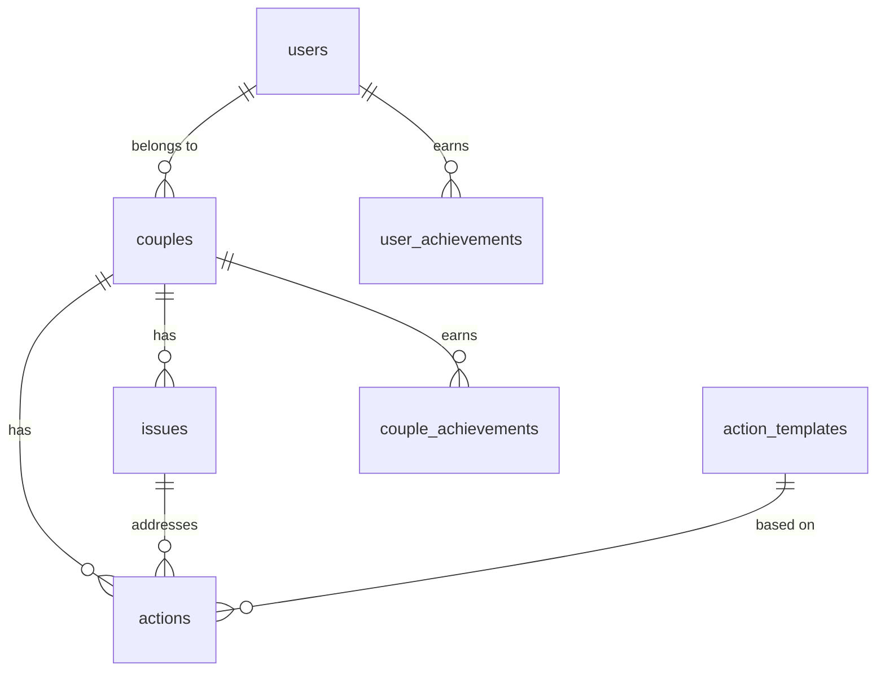

# Database Setup Guide

This guide explains how to set up and use the database for Couple Connect, from development with localStorage to production with Cloudflare D1.

## 🏗️ Database Architecture

The app uses a **hybrid approach**:

- **Development**: localStorage with a database-like interface
- **Production**: Cloudflare D1 (SQLite at the edge)

## 📋 Current Implementation

### LocalStorage Database Service

For development, we've implemented a complete database service layer that uses localStorage but provides the same interface as a real database:

```typescript
// Current usage in components
import { useCurrentUser, useCurrentCouple, useIssues, useActions } from '@/hooks/useDatabase';

function MyComponent() {
  const { user, loading } = useCurrentUser();
  const { couple } = useCurrentCouple();
  const { issues, createIssue, updateIssue } = useIssues();
  const { actions, createAction, updateAction } = useActions();

  // Use like any database...
}
```

### Database Schema

The app supports these core entities:

- **Users** - Individual user profiles
- **Couples** - Relationship between two users
- **Issues** - Problems identified in the mindmap
- **Actions** - Tasks to address issues
- **Action Templates** - Expert-backed action strategies
- **Achievements** - Gamification rewards
- **Activity Log** - Progress tracking

## 🚀 Setting Up Cloudflare D1 (Production)

### Prerequisites

1. Cloudflare account
2. Wrangler CLI installed globally: `npm install -g wrangler`

### Step 1: Authenticate with Cloudflare

```bash
wrangler login
```

### Step 2: Create Database

```bash
npm run db:create
```

This will output something like:

```
database_id = "your-actual-database-id"
```

### Step 3: Update Configuration

Copy the `database_id` from step 2 and update `wrangler.toml`:

```toml
[[d1_databases]]
binding = "DB"
database_name = "couple-connect-db"
database_id = "your-actual-database-id-here"  # Replace with actual ID
```

### Step 4: Create Schema

```bash
npm run db:schema
```

### Step 5: Add Seed Data

```bash
npm run db:seed
```

### Step 6: Deploy

```bash
npm run deploy
```

## 🛠️ Database Development

### Adding New Tables

1. Update `database/schema.sql` with new table definition
2. Add corresponding TypeScript types in `src/services/types.ts`
3. Update database service in `src/services/database.ts`
4. Add React hooks in `src/hooks/useDatabase.ts`

### Example: Adding a new table

```sql
-- database/schema.sql
CREATE TABLE IF NOT EXISTS relationship_goals (
  id TEXT PRIMARY KEY,
  couple_id TEXT NOT NULL REFERENCES couples(id) ON DELETE CASCADE,
  title TEXT NOT NULL,
  description TEXT,
  target_date DATE,
  status TEXT DEFAULT 'active',
  created_at DATETIME DEFAULT CURRENT_TIMESTAMP
);
```

```typescript
// src/services/types.ts
export interface RelationshipGoal {
  id: string;
  couple_id: string;
  title: string;
  description?: string;
  target_date?: string;
  status: 'active' | 'completed' | 'paused';
  created_at: string;
}
```

### Migrating from localStorage to D1

The app is designed to make this transition seamless:

1. **Phase 1** (Current): localStorage with database interface
2. **Phase 2**: Add D1 implementation alongside localStorage
3. **Phase 3**: Data migration utility
4. **Phase 4**: Switch to D1 for new users
5. **Phase 5**: Migrate all users to D1

## 📊 Database Schema Overview



### Key Relationships

- **Users** form **Couples** (1:1 or 1:many relationship design)
- **Couples** identify **Issues** in their relationship
- **Issues** spawn **Actions** to address them
- **Actions** can be based on **Action Templates**
- Progress is tracked through **Activity Log**
- **Achievements** reward positive behavior

## 🔧 Database Commands

```bash
# Development
npm run dev                    # Start with localStorage database

# Database Management
npm run db:create             # Create new D1 database
npm run db:schema             # Apply schema to database
npm run db:seed               # Add initial data
npm run db:setup              # Complete setup (create + schema + seed)

# Deployment
npm run deploy                # Deploy to Cloudflare Pages with D1
```

## 🧪 Development Tools

### Initialize Sample Data

The app automatically initializes with sample data on first run:

```typescript
import { initializeDatabase } from '@/services/initializeData';

// Automatically called in App.tsx
useEffect(() => {
  initializeDatabase();
}, []);
```

### Clear Development Data

```typescript
import { clearDatabase } from '@/services/initializeData';

// Clear all localStorage data
clearDatabase();
```

### Export Data

```typescript
import { exportDatabase } from '@/services/initializeData';

// Get all data for migration
const data = exportDatabase();
console.log(data);
```

## 🔒 Security Considerations

- **Row Level Security**: Each couple's data is isolated
- **User Authentication**: Planned integration with Cloudflare Access or Auth0
- **Data Validation**: Zod schemas for all inputs
- **Privacy**: No cross-couple data access

## 📈 Performance Optimization

- **Edge Database**: D1 runs at Cloudflare edge locations
- **Caching**: React Query for client-side caching
- **Lazy Loading**: Components load data on demand
- **Optimistic Updates**: UI updates immediately, syncs to database

## 🔄 Migration Strategy

When ready to migrate to D1:

1. **Export** current localStorage data
2. **Transform** data format if needed
3. **Import** to D1 database
4. **Switch** database service implementation
5. **Verify** data integrity

This approach ensures zero data loss and minimal disruption.
